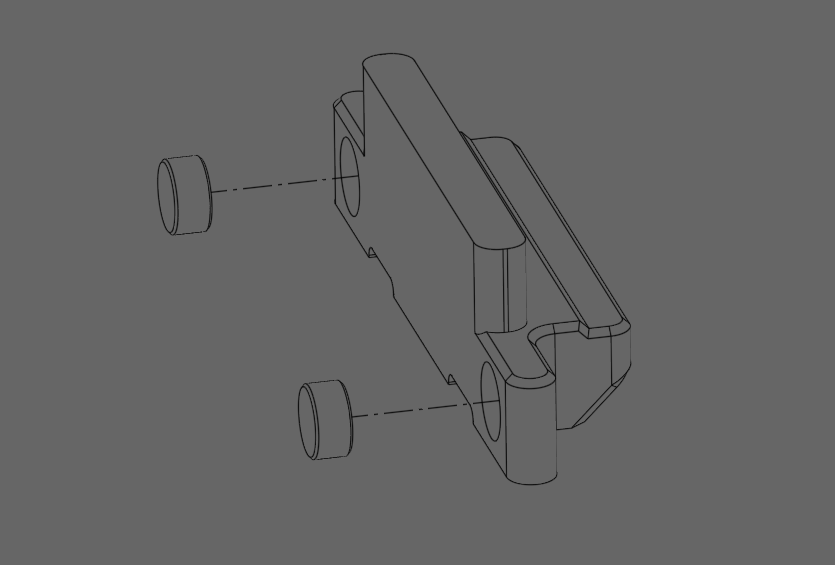
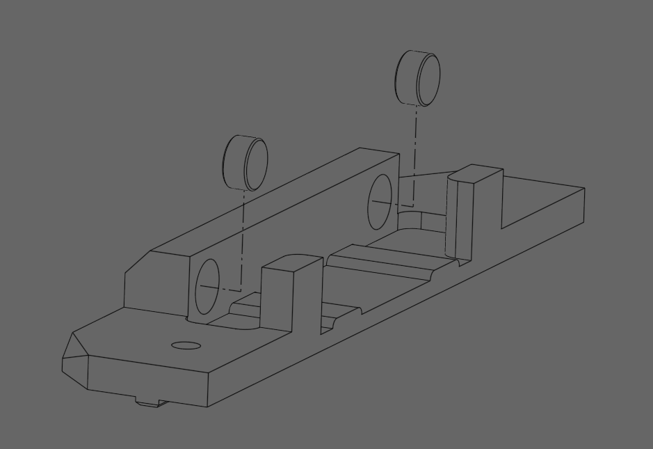

# DoomLatch

## What is it?

The DoomLatch is a compact latching system for Doomified Printer for Ants. It is compact and allows for single hand operation to open and close. The idea was sparked by zarboz on the DOOMCube Discord for his PITCHFork project.

The design utilizes two magnets of like poles to create a dampened spring mechanism to keep the latch closed, since they oppose the installation requires no glue and allows the magnets to be serviceable in the case that they lose their strength over time.

Files for both a pre-supported version and an unsupported version have been provided for convenience.

## BOM:
<table>
<tr>
  <td>Part</td>
  <td>Quantity</td>
  <td>Link</td>
</tr>
<tr>
  <td>6x3mm Magnets</td>
  <td>4</td>
  <td>https://www.amazon.com/FINDMAG-Magnets-Magnetic-Whiteboard-Refrigerator/dp/B08M3YP56J/</td>
</tr>
<tr>
  <td>M3x10mm BHCS</td>
  <td>4</td>
  <td>https://www.amazon.com/uxcell-M3x10mm-Thread-Button-Socket/dp/B01AXUSPYO/</td>
</tr>
<tr>
  <td>M3 Nuts</td>
  <td>4</td>
  <td>https://www.amazon.com/Uxcell-a16033100ux0563-Carbon-Steel-Hexagon/dp/B01IWUSDYY/</td>
</tr>
</table>

## Assembly

### Insert magnets of same pole so that they oppose each other into the Latch and the Base as shown below:

 

### Insert the Latch into the Base as shown below:

### Place the Cover over the Base + Latch assembly from the previous step:

### Bring the Receiver next to the Latch assembly as shown here:

### Insert 4x M3x10 into the locations shown below and fasten the parts as pictured to the printer frame using inserted M3 Nuts:

# Demo Of Latch :

https://github.com/user-attachments/assets/b00e2c3e-3075-42ff-b94a-11ea75025f6f

